# DialogflowV2Demo
参考：
1. https://github.com/abhi007tyagi/DialogflowChat
2. https://github.com/veeyaarVR/dialogflowdemo

相关视频教程
1. https://www.bilibili.com/video/BV1pX4y1A7SH
2. https://www.youtube.com/watch?v=Eo-DDmwmVpg
3. https://www.youtube.com/watch?v=zVxDBBCdpfY

注意事项
1. 访问[https://console.cloud.google.com/welcome](https://console.cloud.google.com/welcome)，并使用google账号登录，截图如下
   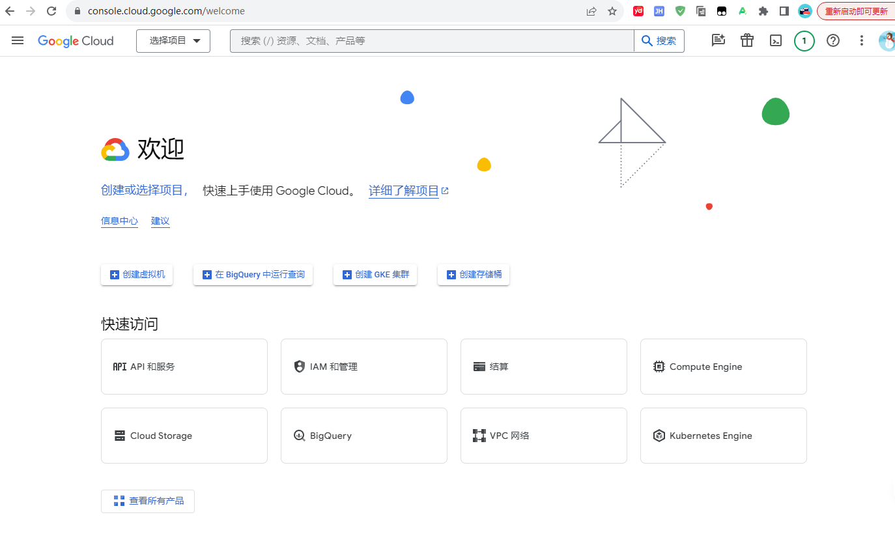
2. 点击“创建或选择项目”-->“新建项目”，截图如下
   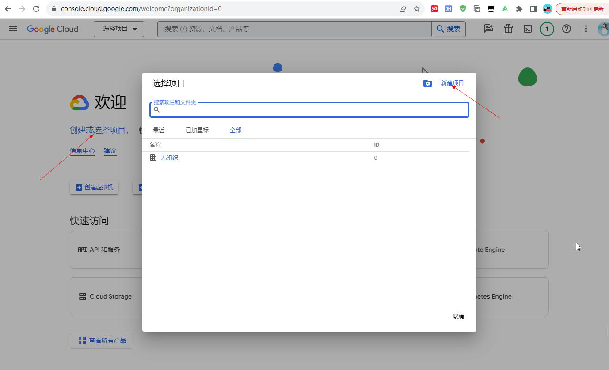
3. 输入项目名称，并点击“创建”，截图如下
   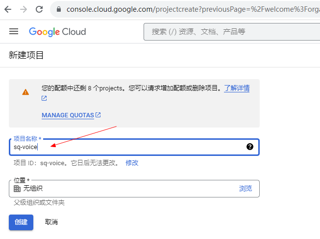
4. 再次进入1，并选择刚刚创建的项目，并在快速访问中点击“IAM和管理”(也可在 查看所有产品 中找到IAM和管理)，截图如下
   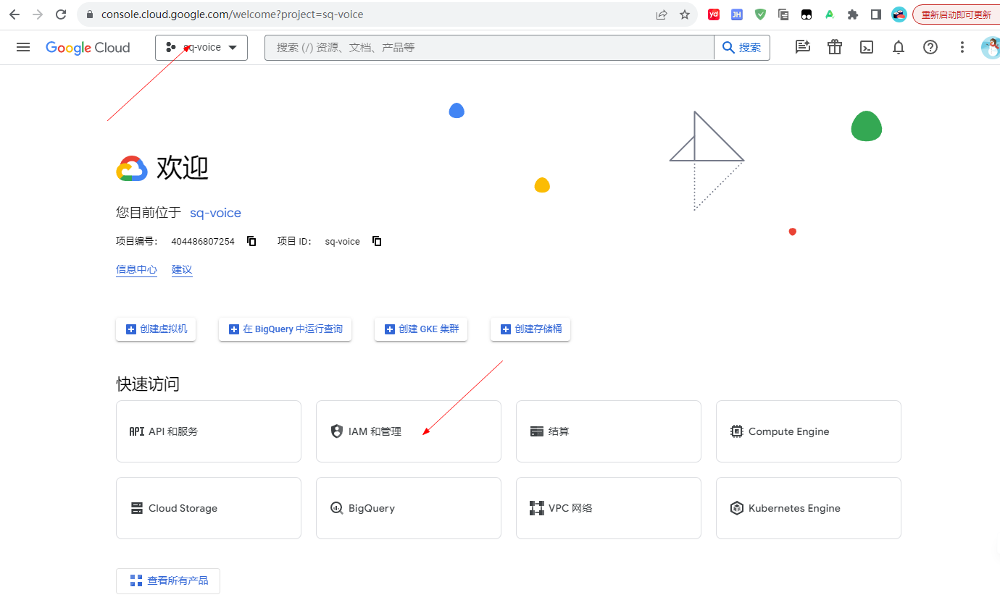
5. 进入“IAM和管理”，点击“创建服务账号”，截图如下
   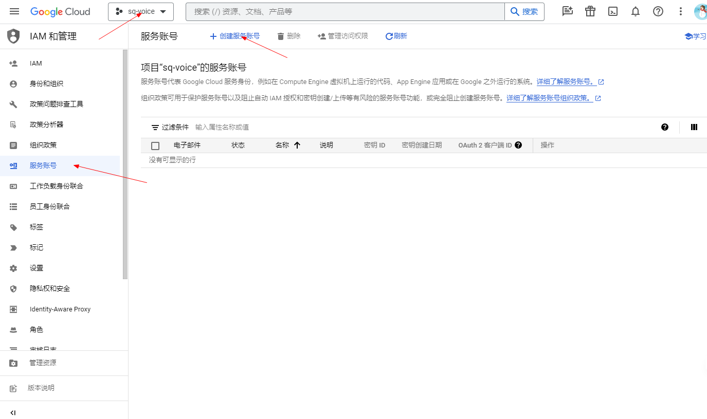
6. 在“创建服务账号”页面，第一步 服务账号详情 中，输入“服务账号名称”，点击“创建并继续”，截图如下
   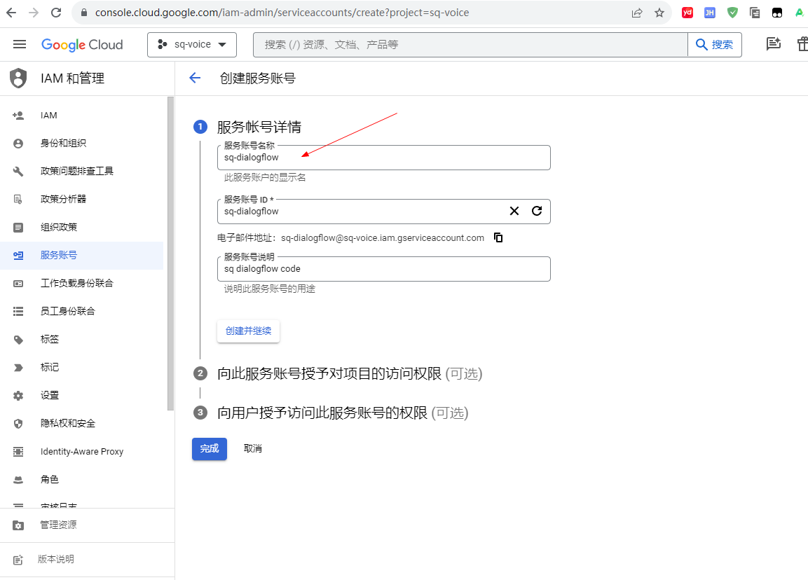
7. 在第二步 向此服务账号授予对项目的访问权限 中，找到dialogflow-->dialogflow API admin并选择，截图如下
   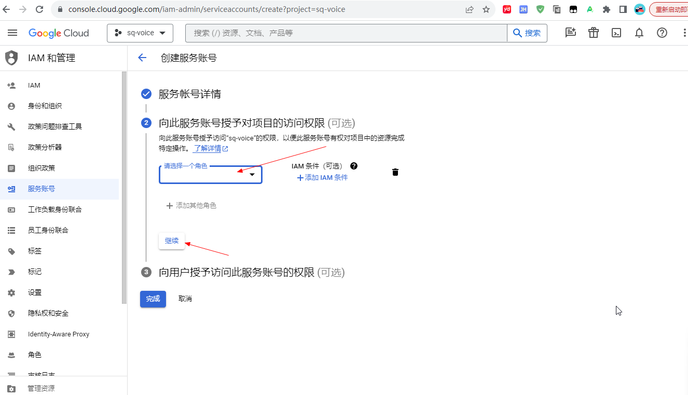
   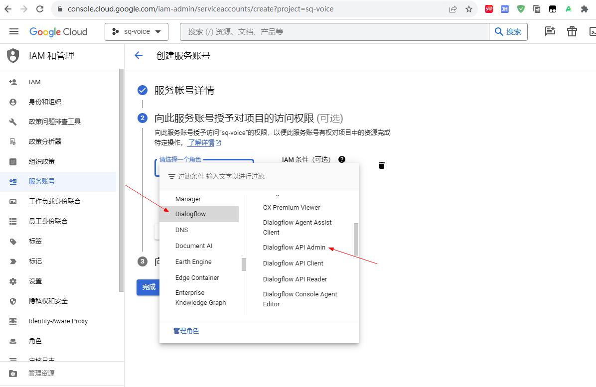
   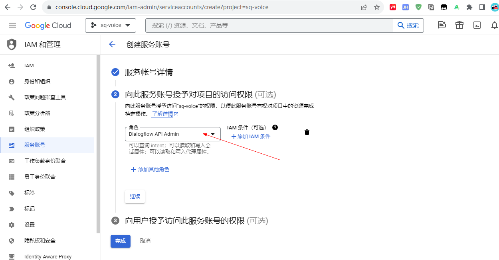
8. 创建服务账号完成后，会进入如下页面，点击电子邮件处进入，并点击“密钥”，截图如下
   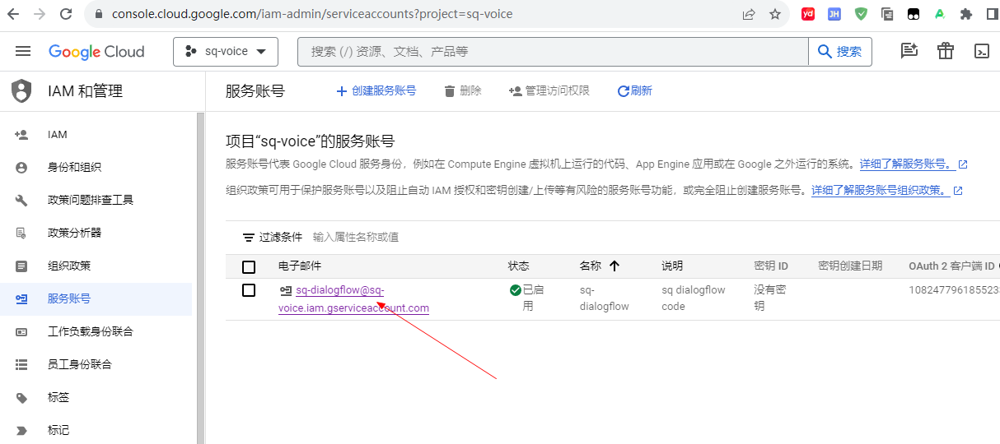
   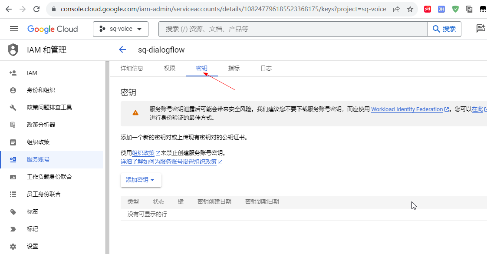
9. 在密钥页面，点击“添加密钥”-->“创建新密钥”，选择JSON并点击“创建”，会得到一个json文件，保存好此文件
   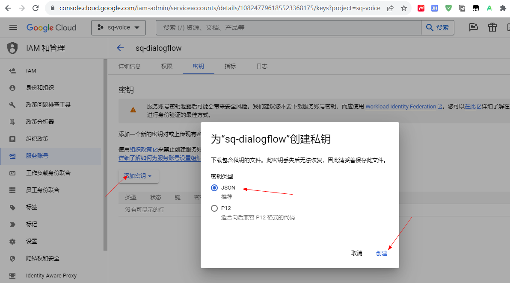
10. 将9中得到的json文件放到res/raw下，并运行项目，输入hi-->发送，dialogflow会返回结果[前提是dialogflow中要创建对应项目的agent]
    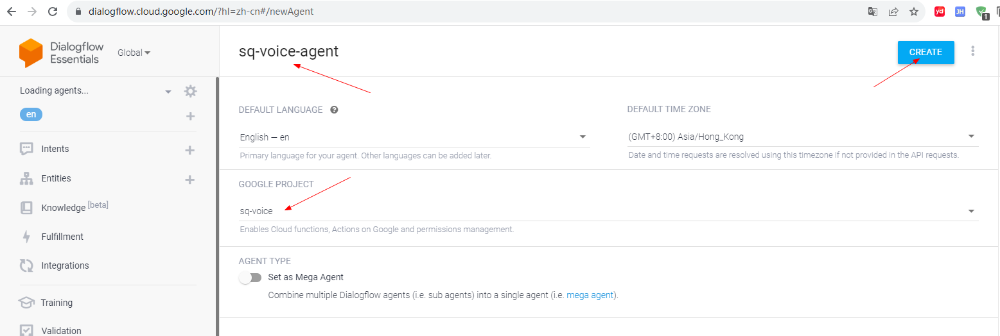
    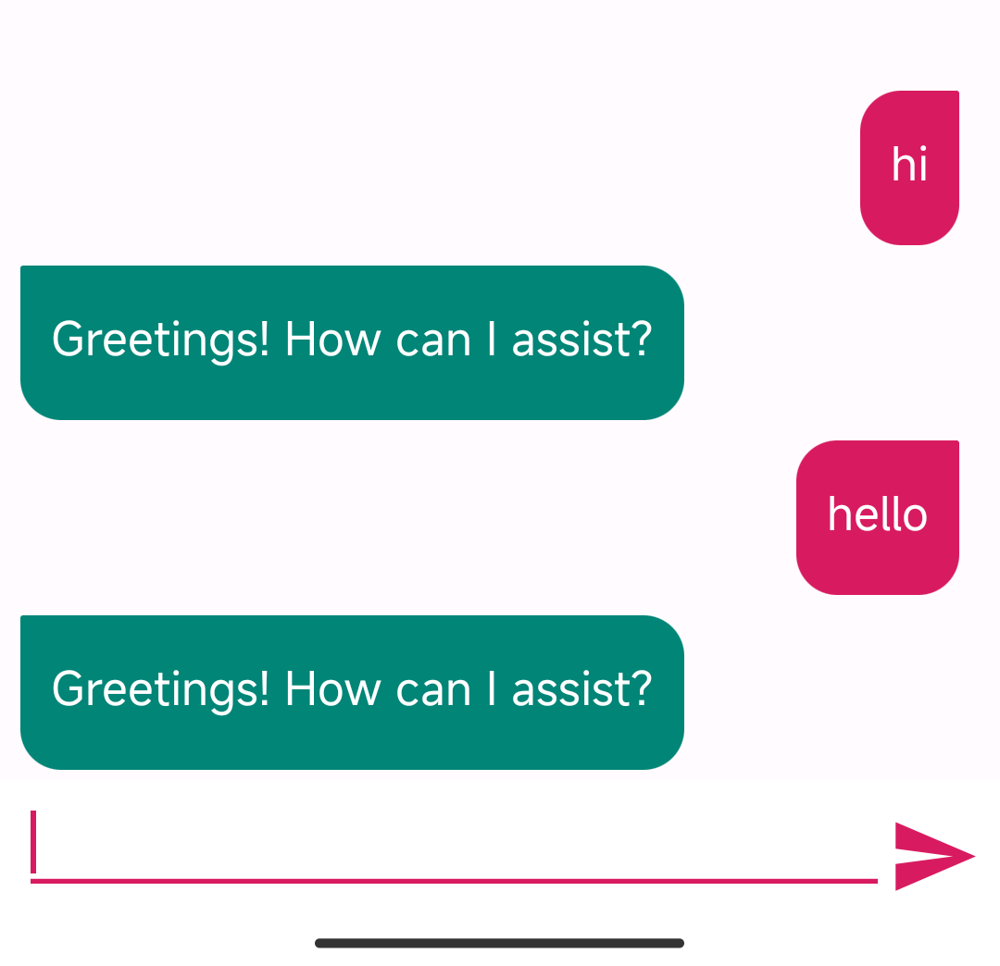